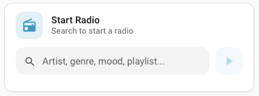

# MA Radio Card

A custom Lovelace card for **Home Assistant + Music Assistant** that lets you type an artist, genre, mood, or playlist name and instantly start a **Music Assistant radio** -- without leaving your dashboard.

## Features

- **Single input** -- type any artist, genre, mood, or playlist name
- **Type selector** -- choose which media type to search (Auto, Artist, Album, Playlist, Radio)
- **Locked player** -- configured once, no dropdown clutter on the dashboard
- **Mushroom-style UI** -- icon avatar, title/subtitle, search icon in input, play button
- **One-tap radio** -- starts Music Assistant's built-in radio (auto-mixes similar tracks)
- **Live feedback** -- status chips, activity log, dynamic subtitle
- **Keyboard support** -- press Enter to search
- **Works with any MA provider** -- Spotify, Tidal, Qobuz, local files, etc.

## Screenshot



## Requirements

- Home Assistant 2025.1.0 or newer
- Music Assistant integration installed and configured
- At least one MA-compatible media player (Sonos, Chromecast, etc.)

## Installation

### Via HACS (recommended)

1. Open HACS in Home Assistant
2. Go to **Frontend** **...** **Custom repositories**
3. Add `https://github.com/Narqulie/ma-radio-card` with category **Lovelace**
4. Click **Install** on the MA Radio Card
5. Hard refresh your browser (Cmd+Opt+R on Safari, Ctrl+Shift+R elsewhere)

### Manual installation

1. Download `ma-radio-card.js` from the [latest release](https://github.com/Narqulie/ma-radio-card/releases)
2. Copy to `config/www/` in your HA directory
3. Add a dashboard resource:
   - **URL:** `/local/ma-radio-card.js`
   - **Resource type:** JavaScript Module
4. Hard refresh your browser

## Configuration

### Card options

| Option | Type | Required | Default | Description |
|--------|------|----------|---------|-------------|
| `type` | string | yes | -- | `"custom:ma-radio-card"` |
| `config_entry_id` | string | **yes** | -- | Music Assistant integration Config Entry ID |
| `player_entity` | string | **yes** | -- | Default MA media player to play on |
| `title` | string | no | `"MA Radio"` | Card header title |
| `icon` | string | no | `"mdi:radio"` | Card header icon |
| `default_type` | string | no | `"auto"` | Default media type selector value. One of: `auto`, `artist`, `album`, `playlist`, `radio` |

### Finding your config_entry_id

1. **Settings -> Devices & Services**
2. Find **Music Assistant**, click the **...** -> **System options**
3. Copy the **Config Entry ID** shown at the top

### YAML example

```yaml
type: custom:ma-radio-card
config_entry_id: "01JXXXXXXX..."
player_entity: "media_player.kitchen_sonos_music_assistant"
title: "Start Radio"
icon: "mdi:radio"
default_type: auto
```

## Usage

1. **Select** the media type from the dropdown (Auto, Artist, Album, Playlist, Radio)
2. **Type** an artist, genre, mood, or playlist name into the search field
3. **Press Enter** or tap the play button
4. The card searches the selected type and plays the best match with radio mode

Examples:
- `Daft Punk` (type: Artist) -> finds the artist, plays artist radio
- `lo-fi hip hop` (type: Playlist) -> finds a playlist, plays playlist radio
- `chill jazz` (type: Auto) -> searches all types, picks best match
- `BBC Radio 1` (type: Radio) -> finds the station, plays it

## How it works

The card uses a plain `HTMLElement` (no Lit, no framework dependencies) and communicates with HA via WebSocket:

1. Calls `music_assistant.search` with `return_response: true` across the selected media types
2. Picks the first result from the chosen type (or scans artist -> playlist -> album -> radio in Auto mode)
3. Calls `music_assistant.play_media` with `radio_mode: true` on the configured player
4. MA auto-queues similar tracks -- instant radio experience

## Development

```bash
git clone https://github.com/Narqulie/ma-radio-card.git
cd ma-radio-card
```

Edit `ma-radio-card.js` and reload your HA frontend (or the inline resource) to test changes.

### Key design decisions

- **Vanilla HTMLElement** -- no Lit imports, works as an inline resource or via HACS
- **No shadow DOM** -- HA's built-in components (`ha-card`, `ha-icon`, `ha-icon-button`) render correctly in light DOM
- **Native `<button>`** for play -- avoids shadow DOM icon rendering issues with `ha-icon-button`
- **CSS variables** from HA's theme (`--rgb-primary-color`, `--primary-text-color`, etc.) for seamless dark/light mode

## Support

- [GitHub Issues](https://github.com/Narqulie/ma-radio-card/issues)

## License

MIT
